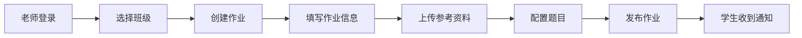
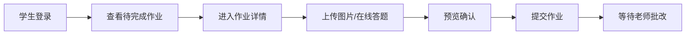
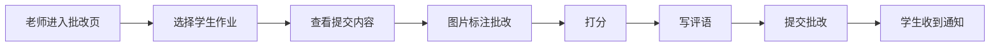

# 学生作业布置与在线批改系统 - 产品需求文档 (PRD)

## 1. 产品概述

面向K12教育和培训机构的在线作业管理平台，提供作业布置、提交、批改、统计全流程数字化解决方案，帮助老师提高批改效率，让学生和家长实时掌握学习情况。

- **核心价值**：解决传统作业批改效率低、反馈不及时、学情数据难追踪的痛点
- **目标用户**：K12学校教师、培训机构老师、中小学生、学生家长
- **产品定位**：轻量级、高效率的作业批改SaaS工具

## 2. 核心功能

### 2.1 用户角色

| 角色 | 登录方式 | 核心权限 |
|------|----------|----------|
| 老师 | 账号密码登录 | 创建班级、布置作业、批改作业、查看统计、催交作业 |
| 学生 | 账号密码登录 / 班级码加入 | 查看作业、提交作业（图片/答题）、查看批改结果 |
| 家长 | 账号密码登录 / 绑定孩子账号 | 查看孩子作业记录、批改分数、学习情况统计 |

### 2.2 功能模块

1. **登录与角色选择**：角色切换登录、账号管理
2. **老师端 - 班级管理**：创建班级、班级二维码/邀请码、学生管理
3. **老师端 - 作业布置**：作业创建、截止时间设置、参考资料上传、题型配置
4. **老师端 - 作业批改**：作业列表、并排批阅、图片标注、打分评语、批量操作
5. **老师端 - 统计分析**：班级平均分、提交率、错误集中点、知识点掌握度
6. **学生端 - 作业列表**：待提交/已提交作业、作业详情、提交入口
7. **学生端 - 作业提交**：图片上传（手写作业）、在线答题、草稿保存
8. **学生端 - 批改结果**：批改详情、分数评语、标注查看
9. **家长端 - 孩子总览**：绑定孩子、作业完成情况、成绩趋势
10. **通知系统**：批改完成通知、催交提醒、作业发布通知

### 2.3 页面详情

| 页面名称 | 模块名称 | 功能描述 |
|----------|----------|----------|
| 登录页 | 角色选择登录 | 三种角色切换登录、表单验证、记住登录 |
| 老师首页 | 工作台概览 | 班级卡片、待批改作业数、今日提醒、快捷入口 |
| 班级管理页 | 班级列表与详情 | 创建班级、班级二维码、学生列表、移除学生 |
| 作业列表页 | 作业管理 | 作业列表、创建作业、作业状态筛选 |
| 作业创建页 | 作业编辑 | 标题/说明/截止时间、参考资料上传、题目配置 |
| 批改列表页 | 待批作业列表 | 提交列表、提交状态、一键催交、批量批改入口 |
| 批改详情页 | 在线批阅 | 并排展示、图片标注工具、打分、文字评语、上一个/下一个 |
| 统计分析页 | 学情数据 | 平均分趋势、提交率统计、错误知识点分布雷达图 |
| 学生首页 | 作业大厅 | 待完成作业、已完成作业、作业通知 |
| 作业提交页 | 提交作业 | 图片上传预览、在线答题表单、草稿保存、提交确认 |
| 批改结果页 | 查看结果 | 批改标注、分数、老师评语、订正入口 |
| 家长首页 | 学习总览 | 孩子信息卡片、最近作业、成绩趋势、待完成提醒 |

## 3. 核心流程

### 3.1 老师布置作业流程

老师登录后进入工作台，选择班级创建作业，填写作业信息（标题、说明、截止时间），上传参考资料，配置题目（可选），发布后学生收到通知。

### 3.2 学生提交作业流程

学生登录后查看待完成作业，进入作业详情，上传手写作业图片或完成在线答题，确认提交后等待老师批改。

### 3.3 老师批改作业流程

老师查看待批改作业列表，进入批改界面，并排查看学生提交，使用标注工具在图片上批改，打分并写评语，完成批改后学生收到通知。

## 4. 用户界面设计

### 4.1 设计风格

- **主色调**：教育蓝 (#2563EB)，传递专业、可信赖的感觉
- **辅助色**：活力橙 (#F97316) 用于强调和提醒，成功绿 (#10B981) 用于完成状态
- **中性色**：深灰 (#1F2937) 文字，中灰 (#6B7280) 次要文字，浅灰 (#F3F4F6) 背景
- **设计风格**：现代简约卡片式设计，清爽干净，适合教育场景长时间使用
- **按钮风格**：圆角矩形按钮，主按钮使用蓝色填充，悬停微亮变效果
- **字体**：Noto Sans SC，清晰易读的中文无衬线字体
- **图标风格**：线性图标，统一粗细，简洁现代
- **动效**：轻柔过渡动画，卡片悬停微浮起效果，页面切换淡入淡出

### 4.2 页面设计概览

| 页面名称 | 模块名称 | UI 元素 |
|----------|----------|---------|
| 登录页 | 角色切换登录 | 三角色Tab切换、卡片式登录表单、品牌插画、渐变背景 |
| 老师工作台 | 数据概览 | 顶部导航、侧边栏菜单、数据统计卡片、快捷操作区、待办列表 |
| 作业批改页 | 并排批阅 | 左右分栏布局、左侧学生列表、右侧批改区域、工具栏悬浮、批注画布 |
| 统计分析页 | 数据可视化 | 图表卡片网格布局、趋势折线图、柱状图、雷达图、数据表格 |
| 学生作业详情 | 作业提交 | 作业信息卡片、图片上传拖拽区、答题表单、分步提交进度 |
| 家长首页 | 学习总览 | 孩子头像卡片、作业日历、成绩趋势图、科目分析环形图 |

### 4.3 响应式

- 采用桌面端优先设计，同时适配平板和手机端
- 侧边栏在移动端收起为汉堡菜单
- 批改界面在小屏幕转为上下布局
- 触控优化：按钮最小 44px，增加点击热区

### 4.4 交互细节

- 图片标注工具：画笔、文字、方框、箭头、橡皮擦，支持多色选择
- 拖拽上传：拖拽区域高亮反馈，上传进度条动画
- 通知提示：右上角Toast通知，支持多种类型（成功/提醒/错误）
- 空状态：友好的空状态插画和引导文案
