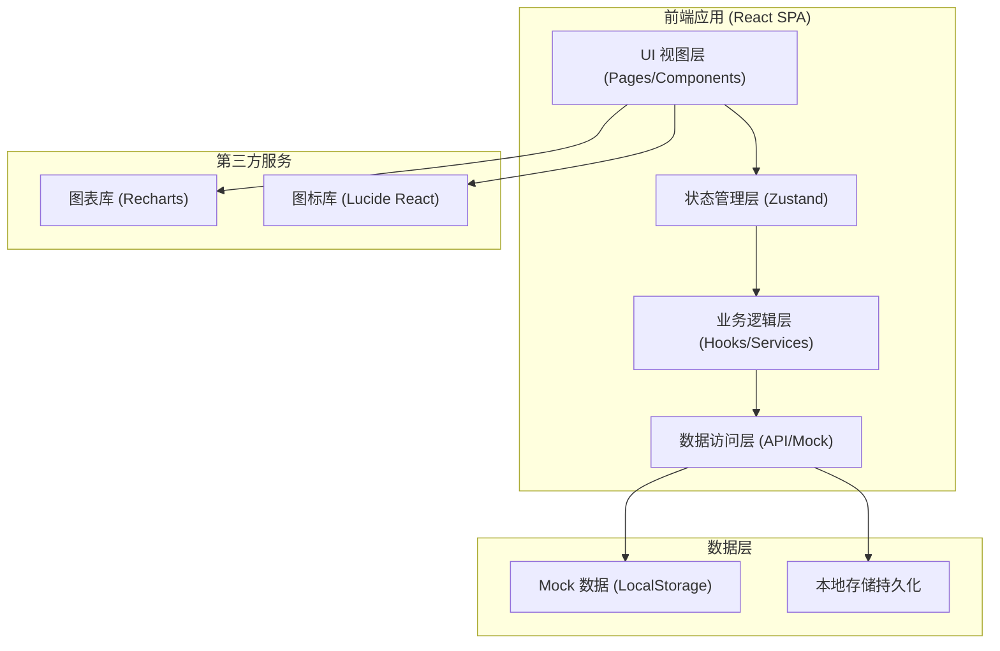

# 学生作业布置与在线批改系统 - 技术架构文档

## 1. 架构设计

本项目采用前端单页应用 (SPA) 架构，使用 Mock 数据模拟后端服务，便于本地开发与演示。整体采用分层架构，确保代码可维护性和可扩展性。



## 2. 技术说明

- **前端框架**: React 18 + TypeScript
- **构建工具**: Vite 5
- **样式方案**: Tailwind CSS 3
- **状态管理**: Zustand (轻量级状态管理)
- **路由**: React Router v6
- **图表库**: Recharts
- **图标库**: Lucide React
- **图片标注**: Canvas API 自定义实现
- **数据持久化**: LocalStorage
- **Mock 数据**: 本地 JSON 数据模拟

## 3. 路由定义

| 路由路径 | 页面名称 | 角色权限 |
|----------|----------|----------|
| `/login` | 登录页 | 公开 |
| `/teacher/dashboard` | 老师工作台 | 老师 |
| `/teacher/classes` | 班级管理 | 老师 |
| `/teacher/classes/:id` | 班级详情 | 老师 |
| `/teacher/assignments` | 作业列表 | 老师 |
| `/teacher/assignments/create` | 创建作业 | 老师 |
| `/teacher/assignments/:id` | 作业详情 | 老师 |
| `/teacher/grading/:assignmentId` | 批改列表 | 老师 |
| `/teacher/grading/:assignmentId/:submissionId` | 批改详情 | 老师 |
| `/teacher/statistics` | 统计分析 | 老师 |
| `/student/dashboard` | 学生首页 | 学生 |
| `/student/assignments/:id` | 作业详情/提交 | 学生 |
| `/student/assignments/:id/result` | 批改结果 | 学生 |
| `/parent/dashboard` | 家长首页 | 家长 |
| `/parent/child/:id` | 孩子学习详情 | 家长 |

## 4. 数据模型

### 4.1 实体关系图

```mermaid
erDiagram
    TEACHER ||--o{ CLASS : "创建"
    CLASS ||--o{ STUDENT : "包含"
    CLASS ||--o{ ASSIGNMENT : "有"
    ASSIGNMENT ||--o{ SUBMISSION : "有"
    ASSIGNMENT ||--o{ QUESTION : "包含"
    STUDENT ||--o{ SUBMISSION : "提交"
    SUBMISSION ||--o{ ANSWER : "包含"
    SUBMISSION ||--o{ ANNOTATION : "有"
    PARENT ||--o{ STUDENT : "绑定"
    
    TEACHER {
        string id PK
        string name
        string email
        string avatar
    }
    
    CLASS {
        string id PK
        string name
        string teacherId FK
        string inviteCode
        string createdAt
    }
    
    STUDENT {
        string id PK
        string name
        string studentNo
        string avatar
        string classId FK
    }
    
    ASSIGNMENT {
        string id PK
        string title
        string description
        string classId FK
        string dueDate
        string createdAt
        string status
        number totalScore
    }
    
    QUESTION {
        string id PK
        string assignmentId FK
        string type
        string content
        number score
        string answer
    }
    
    SUBMISSION {
        string id PK
        string assignmentId FK
        string studentId FK
        string content
        string submittedAt
        string status
        number score
        string comment
        string imageUrl
    }
    
    ANNOTATION {
        string id PK
        string submissionId FK
        string type
        number x
        number y
        string text
        string color
    }
    
    PARENT {
        string id PK
        string name
        string phone
        string[] childIds
    }
```

### 4.2 核心数据结构

```typescript
// 用户相关
interface User {
  id: string;
  name: string;
  role: 'teacher' | 'student' | 'parent';
  avatar: string;
}

// 班级
interface Class {
  id: string;
  name: string;
  teacherId: string;
  teacherName: string;
  inviteCode: string;
  studentCount: number;
  createdAt: string;
}

// 作业
interface Assignment {
  id: string;
  title: string;
  description: string;
  classId: string;
  className: string;
  dueDate: string;
  createdAt: string;
  status: 'draft' | 'published' | 'closed';
  totalScore: number;
  referenceMaterials: ReferenceMaterial[];
  questions: Question[];
  submissionCount: number;
  totalStudents: number;
}

// 提交
interface Submission {
  id: string;
  assignmentId: string;
  studentId: string;
  studentName: string;
  studentAvatar: string;
  images: string[];
  answers: Answer[];
  submittedAt: string;
  status: 'submitted' | 'graded' | 'late';
  score: number | null;
  comment: string;
  gradedAt: string | null;
  annotations: Annotation[];
}

// 标注
interface Annotation {
  id: string;
  type: 'pen' | 'text' | 'rect' | 'highlight';
  x: number;
  y: number;
  width?: number;
  height?: number;
  text?: string;
  color: string;
  strokeWidth?: number;
  points?: { x: number; y: number }[];
}
```

## 5. 状态管理设计

使用 Zustand 管理全局状态，按功能模块划分 Store：

- `useAuthStore`：认证状态、当前用户、角色切换
- `useClassStore`：班级数据、学生管理
- `useAssignmentStore`：作业列表、作业详情
- `useSubmissionStore`：提交数据、批改数据
- `useNotificationStore`：通知消息
- `useUiStore`：UI 状态（侧边栏、弹窗等）

## 6. 项目目录结构

```
src/
├── assets/          # 静态资源
├── components/      # 公共组件
│   ├── ui/         # 基础UI组件
│   ├── layout/     # 布局组件
│   └── common/     # 业务公共组件
├── pages/           # 页面组件
│   ├── login/
│   ├── teacher/
│   ├── student/
│   └── parent/
├── hooks/           # 自定义hooks
├── store/           # 状态管理
├── types/           # TypeScript类型定义
├── utils/           # 工具函数
├── mock/            # Mock数据
├── services/        # API服务
├── App.tsx
├── main.tsx
└── index.css
```

## 7. 关键技术实现

### 7.1 图片标注功能

使用 HTML5 Canvas API 实现：
- 画笔工具：记录鼠标轨迹，绘制自由线条
- 文字标注：点击添加文字，支持编辑
- 矩形框选：拖拽绘制矩形
- 荧光笔：半透明高亮效果
- 撤销/重做：历史记录栈管理
- 标注数据序列化存储

### 7.2 本地数据持久化

使用 LocalStorage 存储：
- 用户登录状态
- 业务数据（班级、作业、提交）
- 系统设置

### 7.3 图表统计

使用 Recharts 实现：
- 平均分趋势折线图
- 提交率柱状图
- 知识点掌握度雷达图
- 分数分布饼图
